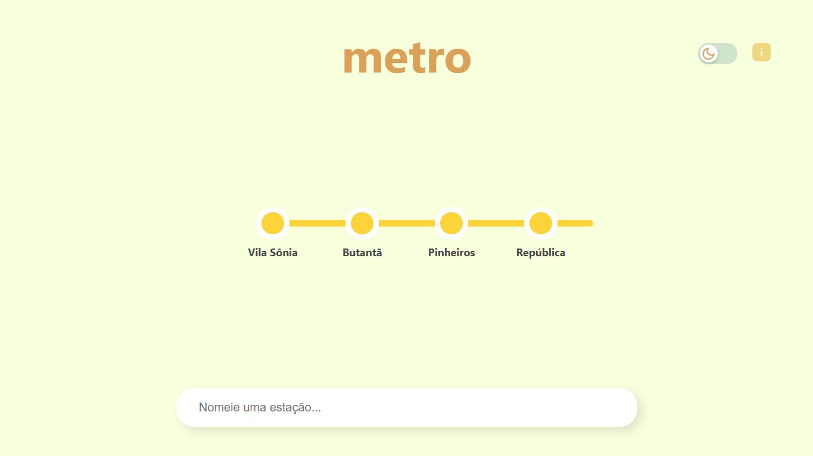

# metro

Um jogo de navegador em que você tem que acertar o nome de todas as estações de metrô / trem de São Paulo.

### Como jogar:
 `Você deve nomear cada uma das estações das linhas de trem e do metrô de São Paulo, sem consultas.` 

 O objetivo é testar seu conhecimento e memória para se lembrar do nome das 184 estações da maior rede metropolitana de transporte ferroviário da América Latina.

Desenvolvido com:
  

    
    
      
  

     
